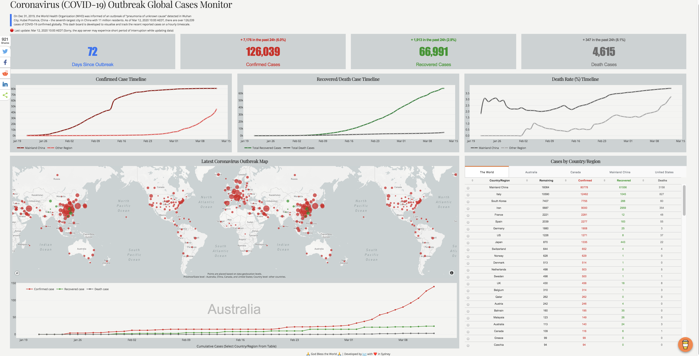

# 2019 Novel Coronavirus (COVID-19) Dashboard Monitor and Data Repository

This public repository achives data and source code for building a dashboard using Dash and Plotly.

Data is sourced from 
* [丁香园](https://ncov.dxy.cn/ncovh5/view/pneumonia?scene=2&clicktime=1579582238&enterid=1579582238&from=singlemessage&isappinstalled=0), * [Tencent News](https://news.qq.com//zt2020/page/feiyan.htm#charts)
* [JCU-CSSE](https://docs.google.com/spreadsheets/d/1yZv9w9zRKwrGTaR-YzmAqMefw4wMlaXocejdxZaTs6w/htmlview?usp=sharing&sle=true#)\

Application is deploying on Heroku and can be accessed from https://dash-coronavirus-2020.herokuapp.com/

