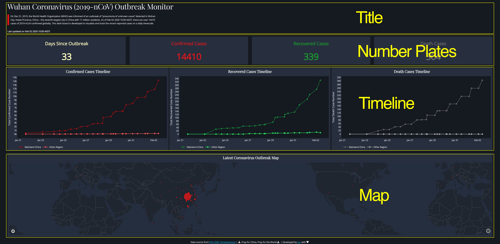
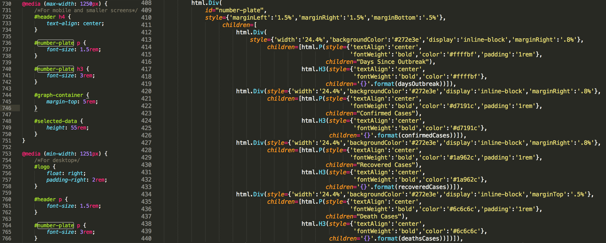
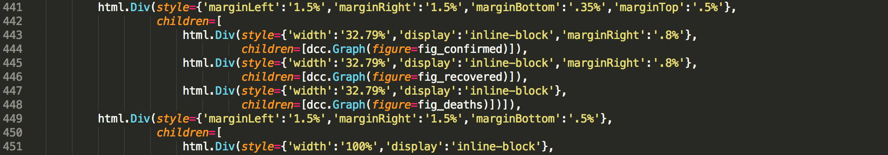
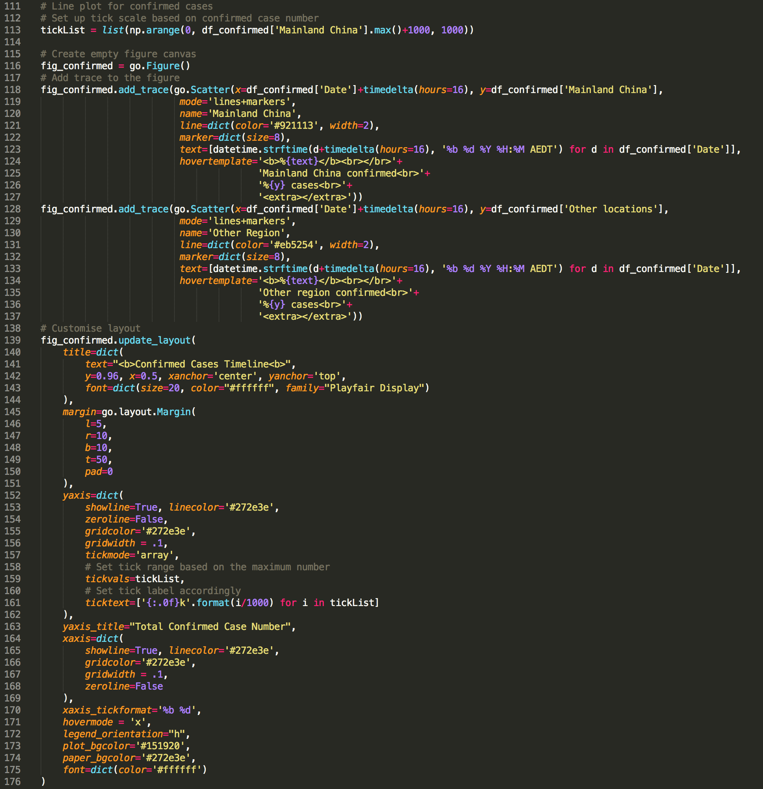

# 用Dash做一个新冠疫情监测仪表板（dashboard）


在python的视觉可视化里，最为人所知的包当属matplotlib，无可否认，学好matplotlib对于理解其他的视觉可视化工具至关重要。然而，随着可视化需求不断朝着高效，交互以及网络进化，matplotlib貌似渐渐力不从心。

在众多新兴的可视化工具包里，plotly以及plotly旗下的dash因为他们的高效以及美观脱颖而出。用户并不需要知道JavaScript就可以实现可视化在网页中的互动。

在这一篇文章里，我给大家分享如何利用dash制作一个新冠疫情的监视器。利用这个[监视器](https://dash-coronavirus-2020.herokuapp.com/)(貌似不能从微信里直接打开，请复制网址去任意浏览器，大屏效果更佳)，我们可以看到实时感染，治愈和死亡病例的数据，以及他们在全球地图上的分布。数据来源与[丁香园](https://ncov.dxy.cn/ncovh5/view/pneumonia?scene=2&clicktime=1579582238&enterid=1579582238&from=singlemessage&isappinstalled=0),[腾讯新闻](https://news.qq.com//zt2020/page/feiyan.htm#charts)和[JHU CSSE](https://docs.google.com/spreadsheets/d/1yZv9w9zRKwrGTaR-YzmAqMefw4wMlaXocejdxZaTs6w/htmlview?usp=sharing&sle=true#)。当然，用Y叔的nCoV-2019 R包同样也可以获得数据。

所有的数据以及代码可以在我的[github](https://github.com/Perishleaf/data-visualisation-scripts/tree/master/dash-2019-coronavirus)里找到。需要注意的是，因为这个应用还在不断的改进中，所以你们下到代码也许跟这里会有所不同，不过框架是一样的。也希望小伙伴有什么新的想法可以在这个repository开个pr，一起做有趣的事情。

### 代码框架
首先让我把这个dash app的代码框架做一个简单的介绍，这样的话，你再去看`app.py`文件的时候就容易的多。其实很简单，整个框架包含三个部分，**数据准备和清理** -> **仪表板排版** -> **生成内容并放入仪表板**。在代码中，你会发现其实第三部分发生在第二部分前，那是给python理解的顺序。

### 数据清理
由于我一开始把不同日期的数据全部放在了一个Excel表格的不同sheet里，从下面的代码中可以看到，这里我使用了`pandas.ExcelFile()`来读取每一个sheet，并把他们存在来一个dict object里(即`dfs`)，所以对于任何一个sheet，我只需要使用dict的key （`keyList`）就可以获取了.
```python
# Import xlsx file and store each sheet in to a df list
xl_file = pd.ExcelFile('./data.xlsx',)

dfs = {sheet_name: xl_file.parse(sheet_name) 
          for sheet_name in xl_file.sheet_names}

# Data from each sheet can be accessed via key
keyList = list(dfs.keys())

# Data cleansing
for key, df in dfs.items():
    dfs[key].loc[:,'Confirmed'].fillna(value=0, inplace=True)
    dfs[key].loc[:,'Deaths'].fillna(value=0, inplace=True)
    dfs[key].loc[:,'Recovered'].fillna(value=0, inplace=True)
    dfs[key]=dfs[key].astype({'Confirmed':'int64', 'Deaths':'int64', 'Recovered':'int64'})
    # Change as China for coordinate search
    dfs[key]=dfs[key].replace({'Country/Region':'Mainland China'}, 'China')
    dfs[key]=dfs[key].replace({'Province/State':'Queensland'}, 'Brisbane')
    dfs[key]=dfs[key].replace({'Province/State':'New South Wales'}, 'Sydney')
    dfs[key]=dfs[key].replace({'Province/State':'Victoria'}, 'Melbourne')
    dfs[key]=dfs[key].replace({'Province/State':'South Australia'}, 'Adelaide')
    # Add a zero to the date so can be convert by datetime.strptime as 0-padded date
    dfs[key]['Last Update'] = '0' + dfs[key]['Last Update']
    dfs[key]['Date_last_updated'] = [datetime.strptime(d, '%m/%d/%Y %H:%M') for d in dfs[key]['Last Update']]
```
因为我们会把数据点映射到地图上，那么每个地点必须要有经纬度信息dash才知道应该把数据点放在地图相对应的位置。这里我推荐大家使用[OpenCageGeocode](https://opencagedata.com/), 一个免费的供我们接入查询经纬度信息的网站(2500次request每天，足够我们用了)。注册之后，只需要把你的key复制到下面代码对应的地方就可以了。

```python
# Add coordinates for each area in the list for the latest table sheet
# As there are limit for free account, we only call coordinates for the latest table sheet
from opencage.geocoder import OpenCageGeocode
key = 'Your key number'  # get api key from:  https://opencagedata.com
geocoder = OpenCageGeocode(key)

list_lat = []   # create empty lists
list_long = []    
for index, row in dfs[keyList[0]].iterrows(): # iterate over rows in dataframe
    City = row['Province/State']
    State = row['Country/Region']

    if City:
        if City == 'Macau' or City == 'Hong Kong':
            query = str(City)+','+'China'
            results = geocoder.geocode(query)   
            lat = results[0]['geometry']['lat']
            long = results[0]['geometry']['lng']

            list_lat.append(lat)
            list_long.append(long)
        else:
            query = str(City)+','+str(State)
            results = geocoder.geocode(query)   
            lat = results[0]['geometry']['lat']
            long = results[0]['geometry']['lng']

            list_lat.append(lat)
            list_long.append(long)

    else:
        query = str(State)
        results = geocoder.geocode(query)   
        lat = results[0]['geometry']['lat']
        long = results[0]['geometry']['lng']

        list_lat.append(lat)
        list_long.append(long)
# create new columns from lists    
dfs[keyList[0]]['lat'] = list_lat   
dfs[keyList[0]]['lon'] = list_long

dfs[keyList[0]].to_csv("{}_data.csv".format(keyList[0]), index=False)
```

### 仪表板排版
因为这是一个基于网页的应用，那么就避免不了要跟HTML嵌套结构打交道。如果你不懂HTML，没有关系，dash给我们提供`dash-html-components`包来应对这个，我们只需要用python语言来排版。HTML的排版有时候是一件非常头疼的事情，所以这里我们就用最简单的排版。


首先我们需要理解`html.Div()`，你可以把它理解为一个能够展示你的内容的容器，而且它内部的结构是层层深入的。如图1所示，这个应用总共有四个容器(准确的说应该是五个，最下面的那行小字也是在一个容器里)。比如说在Title容器中，我们有一个html.H4组件和两个html.P组件。H4就是第四级标题，P就是段落。那么在number plates容器中(图2)，我们有四个容器，那么每个容器又包含了一个html.P和一个html.H3组件。那么接下来的容易就很容易理解了吧。


### 生成内容并放入仪表板

框架搭好以后，我们就可以把内容放进去了。这里我们先看Timeline这个容器的代码(图3)，这个容器主要是展示确诊，恢复和死亡病例的历史数据，其中数据是被分为了中国大陆及其他地区两组。

我们可以看到在一个大的html.Div容器里有3个子html.Div容器。每个子容器中包含装饰代码和一个dcc.Graph组件，这个组件就是dash厉害的地方，它可以把plotly做的图无缝衔接到这个网页应用中。也就是说我们在图2中看到的线图就是在plotly里画出来的。如果你比较熟悉matplotlib的画图结构，你会发现plotly的画图结构也是类似的。你先创建一个画布`fig = go.Figure()`，然后一层层添加内容trace进去。然后在update_layout里设置你想要的模样。图4给出了其中的一个例子。


### 部署应用
到这一步，你就可以直接在你电脑里运行这个应用了。在terminal里输入`python app.py`(所有文件都要在一个文件夹里)，然后你会看到以下信息：
```bash
Running on http://127.0.0.1:8050/
Debugger PIN: 707-347-654
 * Serving Flask app "app" (lazy loading)
 * Environment: production
   WARNING: This is a development server. Do not use it in a production deployment.
   Use a production WSGI server instead.
 * Debug mode: on
```
把那个网址放到浏览器中，一个新鲜的网页版应用就出炉了。

当然我们也可以把应用部署到服务器上分享给更多的人，这里我推荐使用heroku，非常容易上手，有很详尽操作[指导](https://devcenter.heroku.com/articles/getting-started-with-python)，而且是免费的.

理解了以上的点，你就能够做一个你自己的网页应用了。

本文的英文版本可以在[这里](https://towardsdatascience.com/build-a-dashboard-to-track-the-spread-of-coronavirus-using-dash-90364f016764)找到。

这是我的[网站](https://junye0798.com/)，欢迎给我留言讨论！